# 第1关：基本测试

根据S-AES算法编写和调试程序，提供GUI解密支持用户交互。输入可以是16bit的数据和16bit的密钥，输出是16bit的密文。

## 1. 1 加密算法测试结果

|     **明文**     |     **密钥**     |     **密文**     |
| :--------------: | :--------------: | :--------------: |
| 1111111111111111 | 1111111111111111 | 0101001101000011 |
| 0000000000000000 | 1111111111111111 | 0000100011000001 |
| 1111111111111111 | 0000000000000000 | 0010100100110000 |
| 0000000000000000 | 0000000000000000 | 0000011100011110 |
| 1010101010101010 | 1010101010101010 | 1010111110111000 |

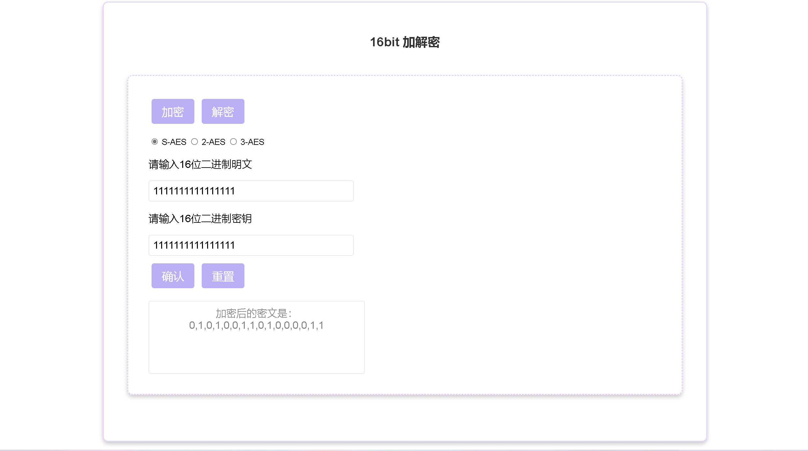

## 1.2 解密算法的测试结果

|     **密文**     |     **密钥**     |     **明文**     |
| :--------------: | :--------------: | :--------------: |
| 0101001101000011 | 1111111111111111 | 1111111111111111 |
| 0000100011000001 | 1111111111111111 | 0000000000000000 |
| 0010100100110000 | 0000000000000000 | 1111111111111111 |
| 0000011100011110 | 0000000000000000 | 0000000000000000 |
| 1010111110111000 | 1010101010101010 | 1010101010101010 |

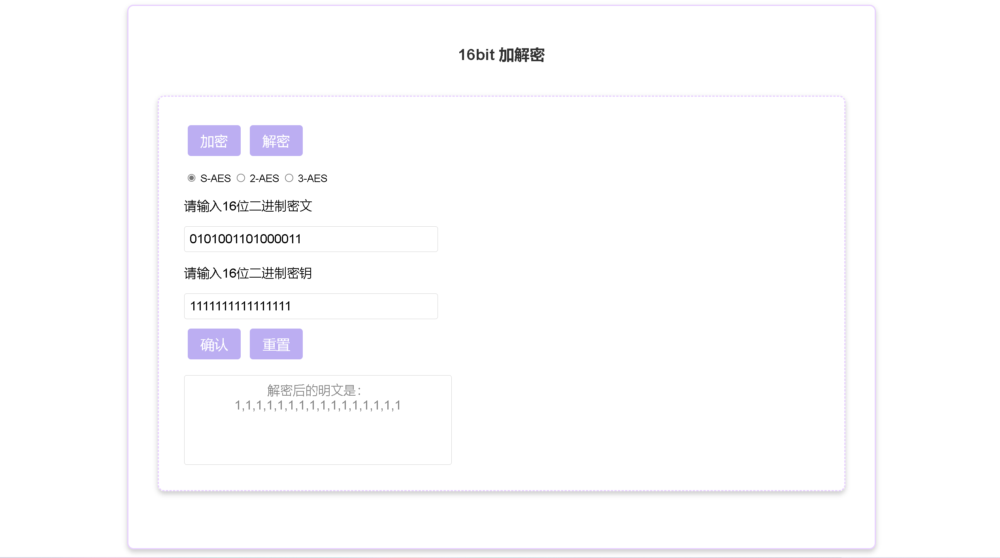

# 第2关：交叉测试

# 第3关：扩展功能

## 3.1 ASII加解密

考虑到向实用性扩展，加密算法的数据输入可以是ASII编码字符串(分组为1 Byte)，对应地输出也可以是ACII字符串(很可能是乱码)。

### 3.1.1 加密算法测试结果

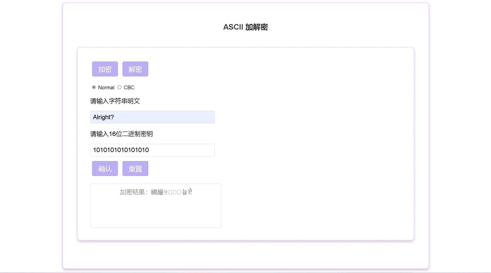

### 3.1.2 解密算法测试结果

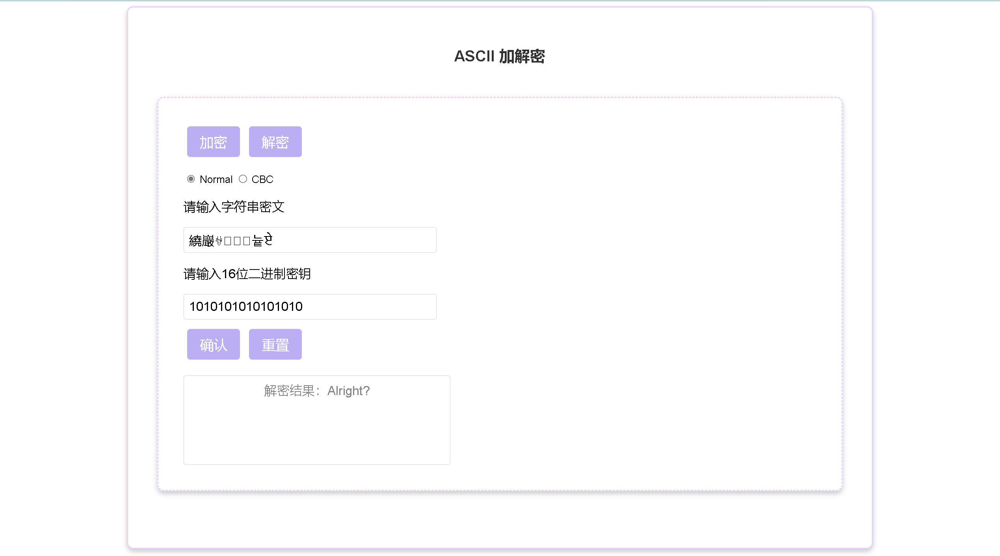

## 3.2 文件加密

### 3.2.1 加密算法测试结果

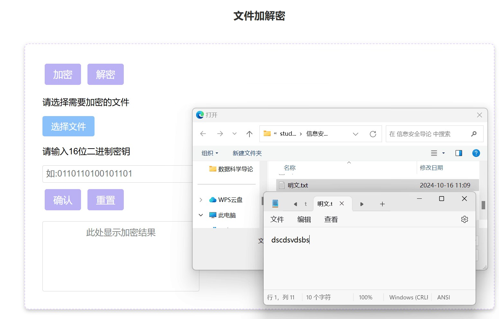

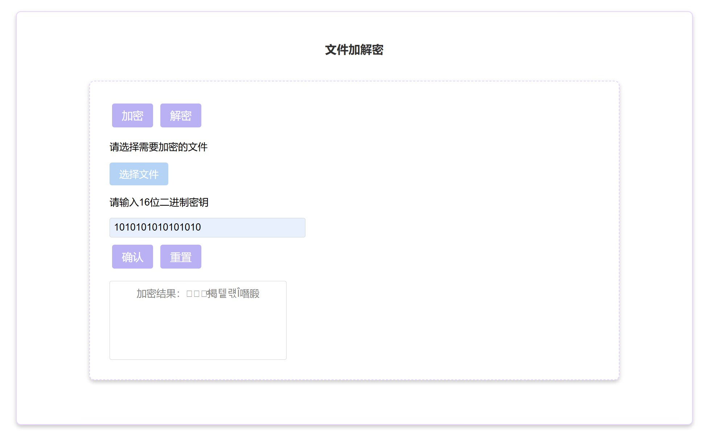

### 3.2.2 解密算法测试结果

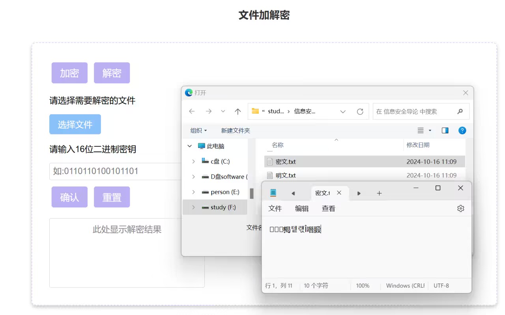

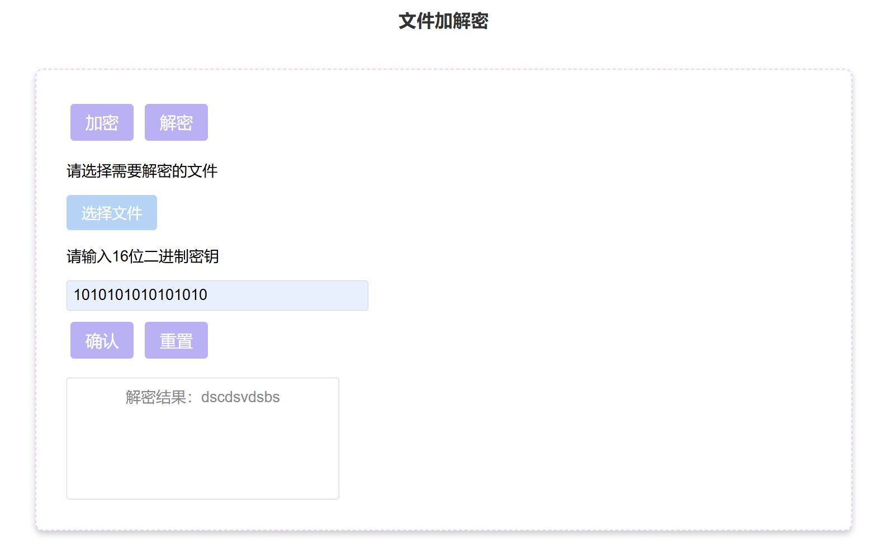

# 第4关：多重加密

## 4.1 双重加密

### 4.1.1 加密算法测试结果

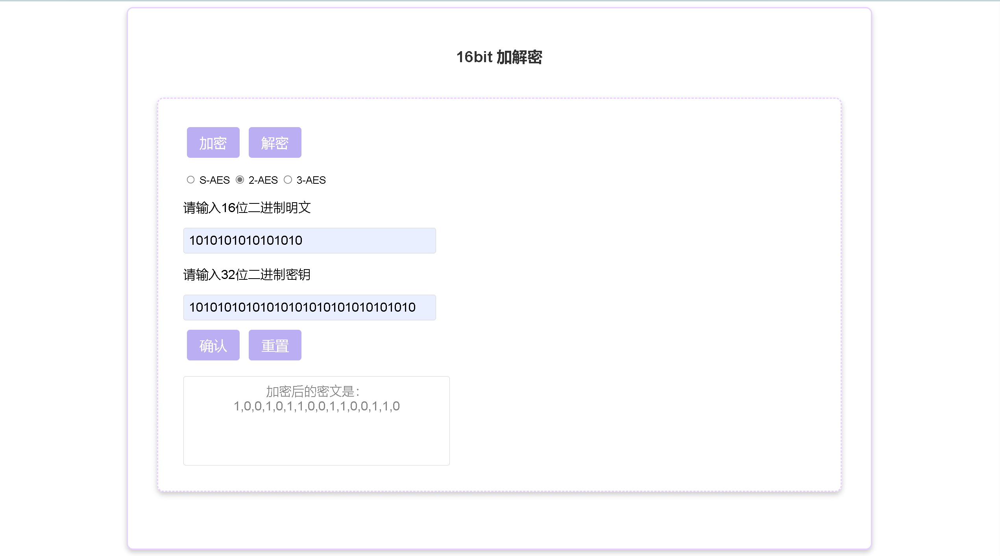

### 4.1.2 解密算法测试结果

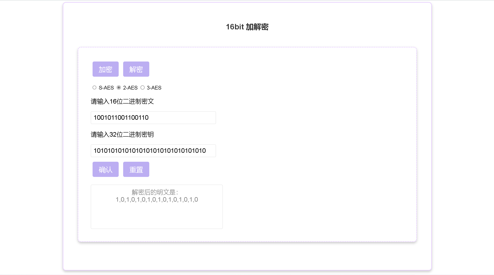

## 4.2 中间相遇攻击

破解明密文对1111111111111111-1100101111001011，结果如下：

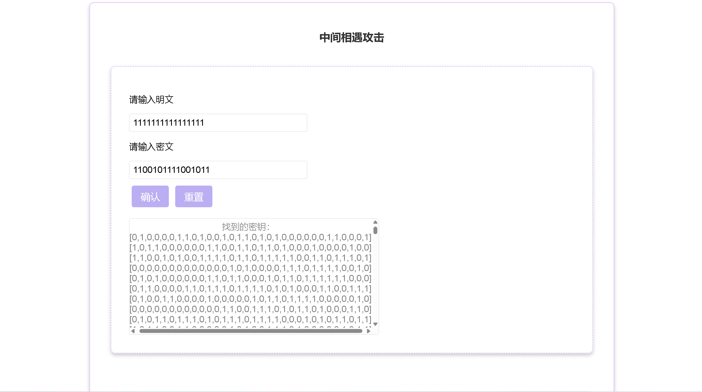

根据给出的第一个密钥进行验证，可以看到得到密文

## 4.3 三重加密

### 4.3.1 加密算法测试结果

### 4.3.2 解密算法测试结果

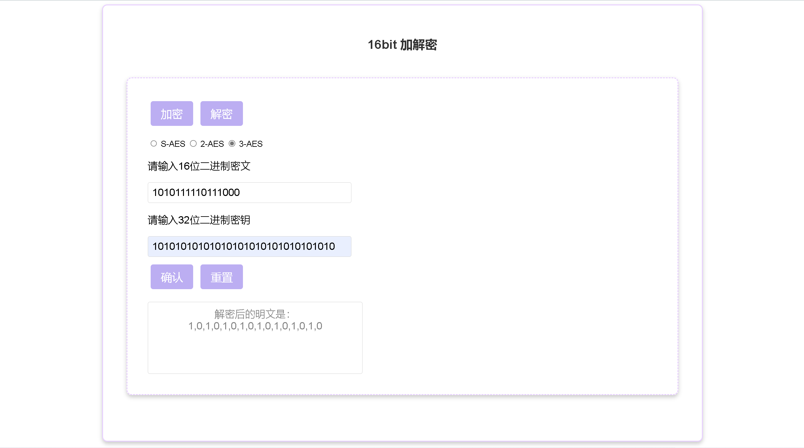

# 第5关：工作模式

基于S-AES算法，使用密码分组链(CBC)模式对较长的明文消息进行加密。注意初始向量(16 bits) 的生成，并需要加解密双方共享。

在CBC模式下进行加密，并尝试对密文分组进行替换或修改，然后进行解密，请对比篡改密文前后的解密结果。

## 5.1 加密算法测试结果

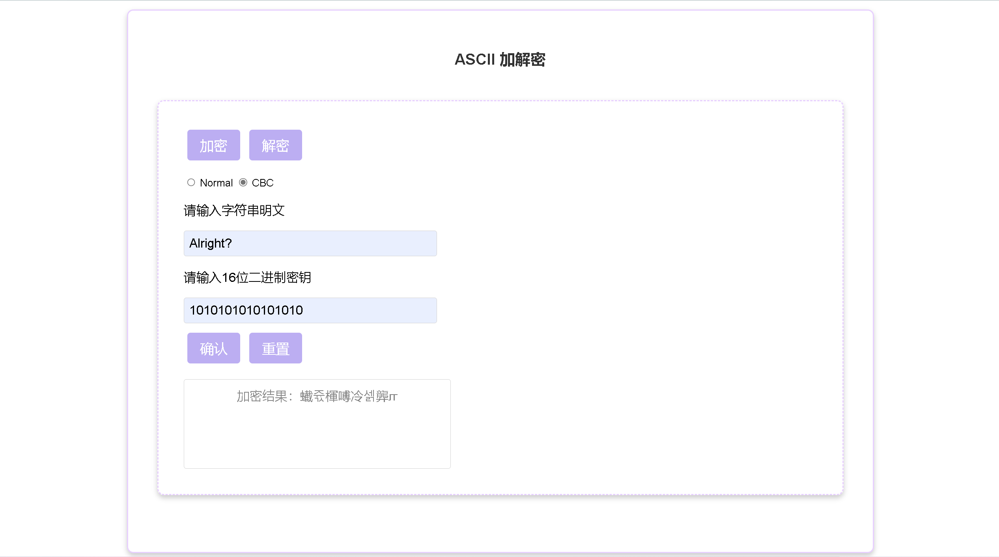

## 5.2 解密算法测试结果

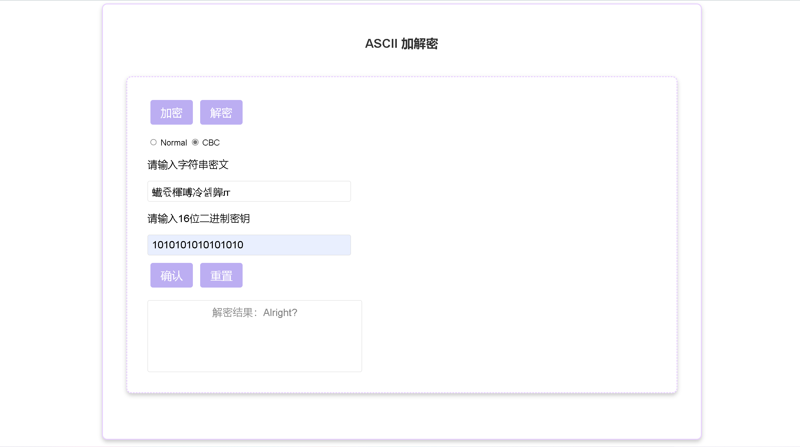