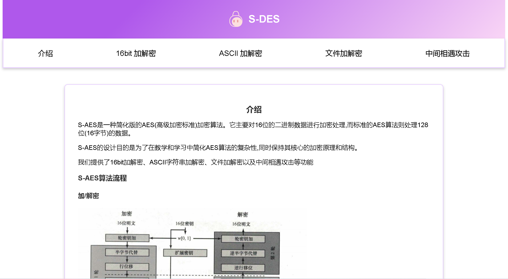
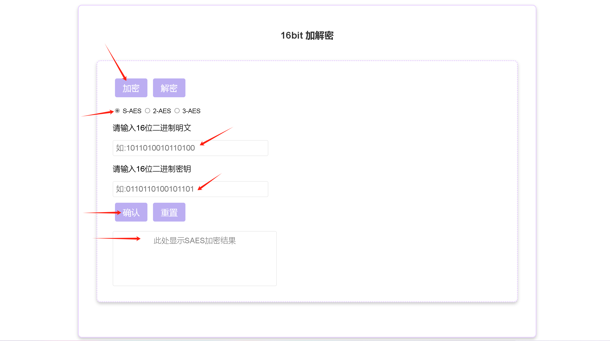
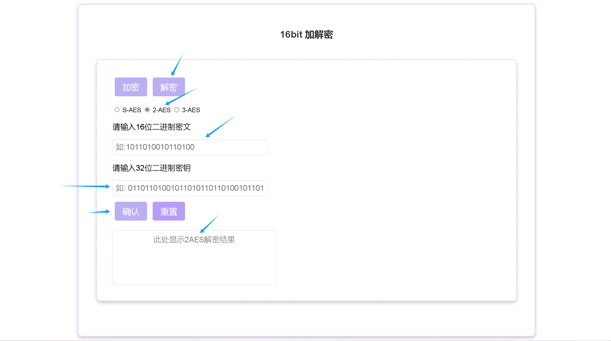
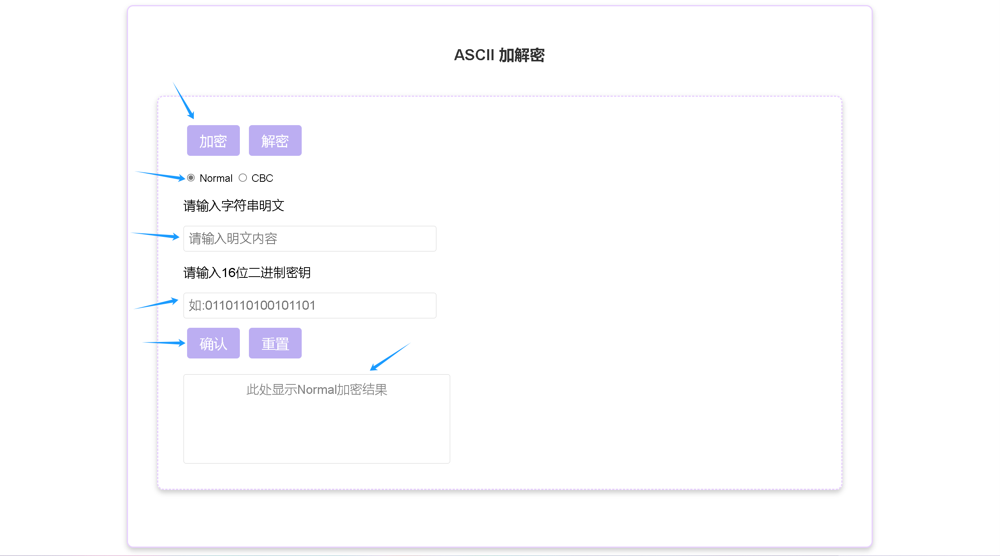
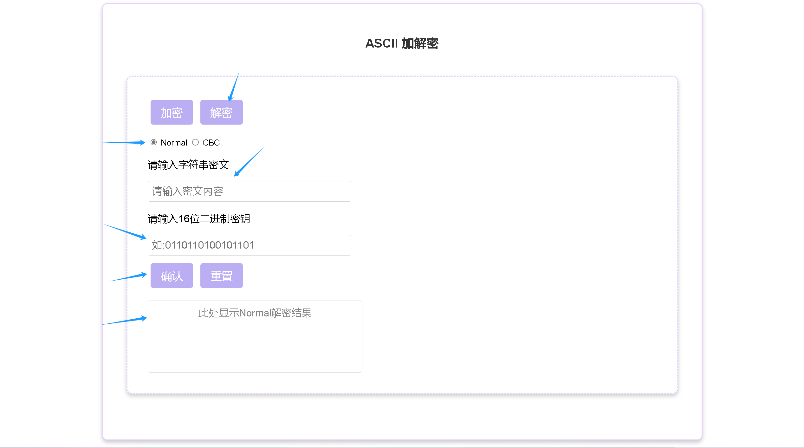
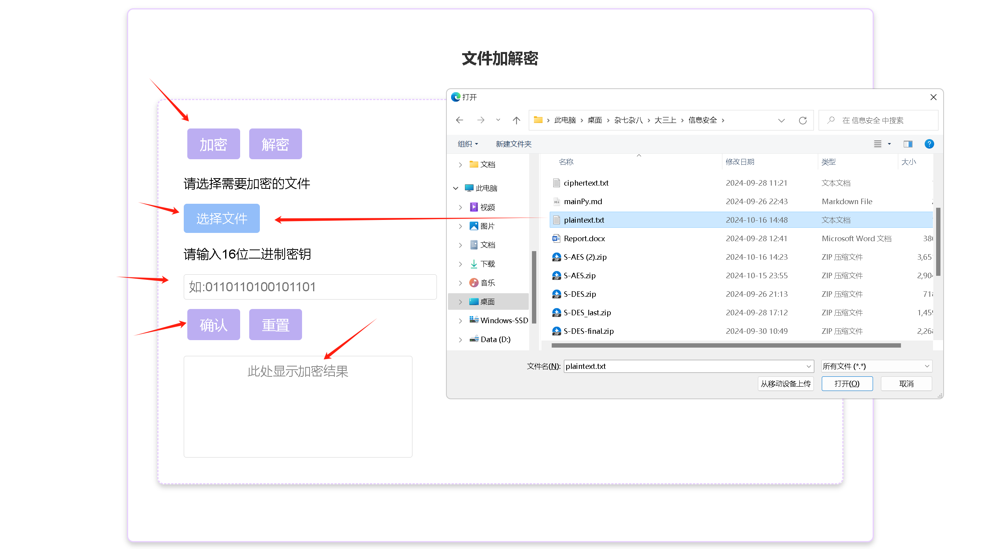
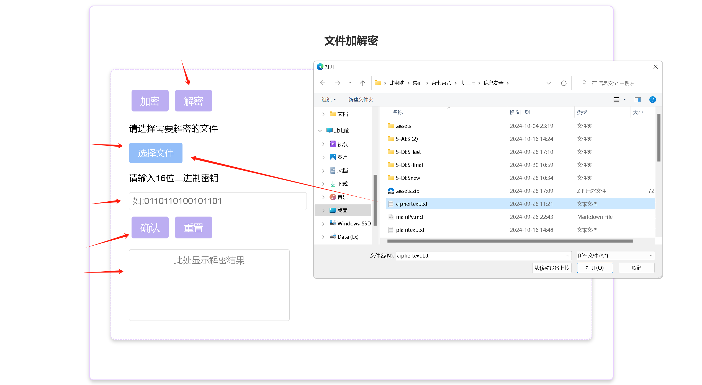
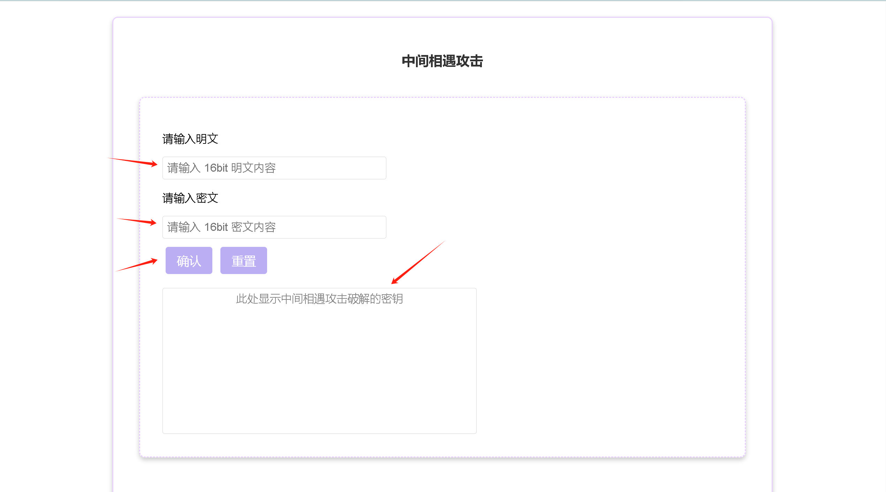

# 用户指南——SIMPLE-AES加密解密系统

## 1. 系统简介

S-AES是一种简化版的AES(高级加密标准)加密算法。它主要对16位的二进制数据进行加密处理,而标准的AES算法则处理128位(16字节)的数据。

S-AES的设计目的是为了在教学和学习中简化AES算法的复杂性,同时保持其核心的加密原理和结构。

我们提供了16bit加解密、ASCII字符串加解密、文件加解密以及中间相遇攻击等功能。


## 2. 环境配置

### 2.1 安装Python

请确保您的计算机上已经安装了Python 3.10。您可以通过访问Python的官方网站来下载并安装。

### 2.2 安装依赖

1. 打开命令提示符或终端。
2. 切换到系统的根目录。
3. 输入并执行以下命令来安装必要的依赖包：

```
pip install -r requirements.txt
```

## 3. 启动程序

在系统根目录下，执行以下命令：

```
python main.py
```

您应该能看到一些启动信息。成功启动后，使用您的浏览器访问`http://127.0.0.1:8080`即可进入系统的主界面。


## 4. 主界面介绍

系统的主界面主要分为以下五个板块：

- 介绍：主界面，主要介绍SIMPLE-AES的基本原理。
- 16bits加密区：对16bits二进制数进行加解密。
- ASCII码加解密区：对ASCII码进行加解密。
- 文件加解密区：对文件内容进行加解密。
- 中间相遇攻击：输入明文密文，中间相遇攻击破解密钥。




## 5. 使用讲解

### 5.1 16bits加密区

1. 点击“加密”或者“解密”按钮。
2. 选择您需要加解密的类型：S-AES    2-AES    3-AES
   - 选择S-AES：密钥长度为16位
   - 选择2-AES：密钥长度为32位
   - 选择3-AES：密钥长度为32位
3. 如果点击“加密”按钮，则在输入框中按要求分别输入明文和密钥。按要求输入完成后，点击“确认”按钮，下方显示框会显示加密后的密文。



4. 如果点击“解密”按钮，则在输入框中按要求分别输入密文和密钥。按要求输入完成后，点击“确认”按钮，下方显示框会显示解密后的明文。



5. 点击“重置”按钮将会清空输入框内容。

### 5.2 ASCII码加解密区

1. 点击“加密”或者“解密”按钮。
2. 选择您需要加密的类型：Normal    CBC
3. 如果点击“加密”按钮，则在输入框中分别输入字符串明文和16位二进制密钥。按要求输入完成后，点击“确认”按钮，下方显示框会显示加密后的密文。



4. 如果点击“解密”按钮，则在输入框中分别输入字符串密文和16位二进制密钥。按要求输入完成后，点击“确认”按钮，下方显示框会显示解密后的明文。



5. 点击“重置”按钮将会清空输入框内容。


### 5.3 文件加解密区

1. 点击“加密”或者“解密”按钮。

2. 如果点击“加密”按钮，点击“选择文件”按钮，选择需要加密的文件。在输入框中按要求输入10位二进制密钥。按要求输入完成后，点击“确认”按钮，下方显示框会显示加密后的密文。



3. 如果点击“解密”按钮，点击“选择文件”按钮，选择需要解密的文件。在输入框中按要求输入10位二进制密钥。按要求输入完成后，点击“确认”按钮，下方显示框会显示解密后的明文。



4. 点击“重置”按钮将会清空输入框内容。

### 5.4 中间相遇攻击区

1. 在输入框中分别输入16位二进制明文和16位二进制密文。
2. 点击“确认”按钮后，系统将尝试所有可能的密钥组合，并在找到正确的密钥后在下方输出正确的密钥Key和暴力破解所用的破译时间。
3. 点击“重置”按钮将会清空输入框内容。




## 6. 故障排查

### 6.1 无法启动系统

- 确保Python版本为3.10。
- 确保所有依赖都已经正确安装。

### 6.2 加解密出错

- 检查您的输入是否正确。
- 如果是文件，确保文件格式被系统支持。
- 如果问题持续，请联系我们的技术支持。